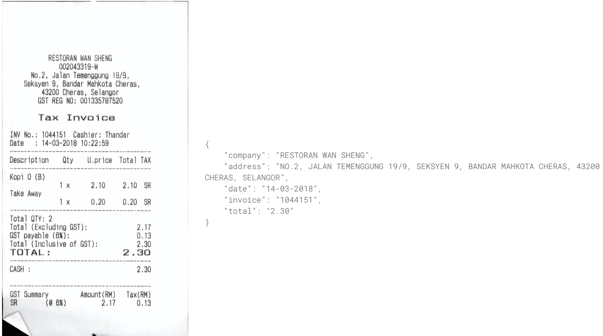
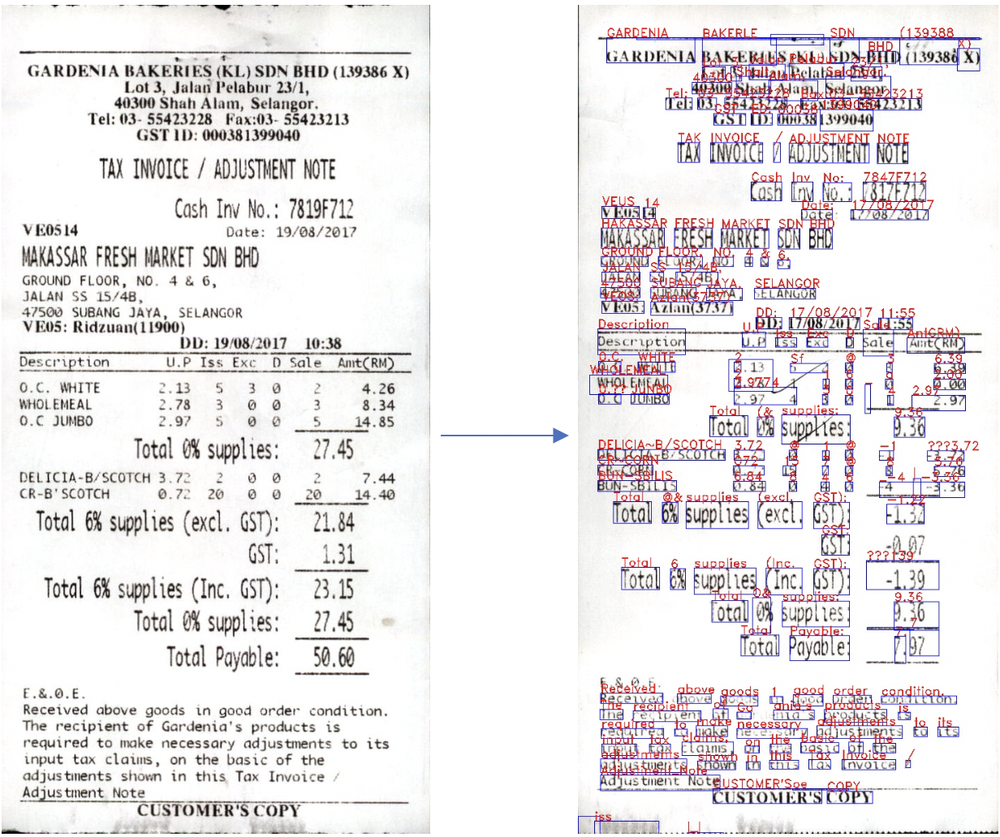
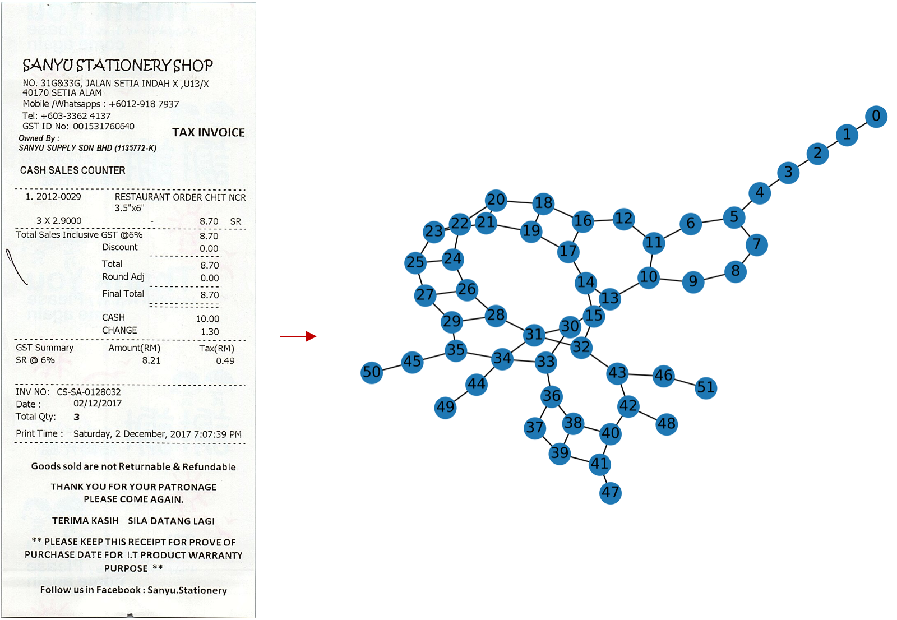
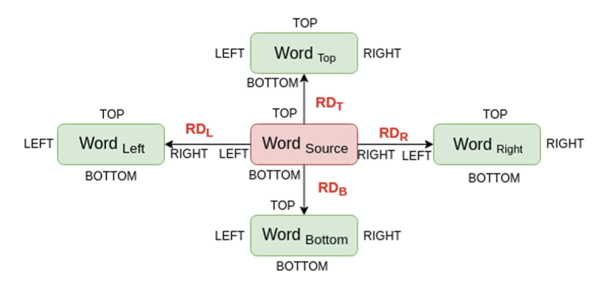
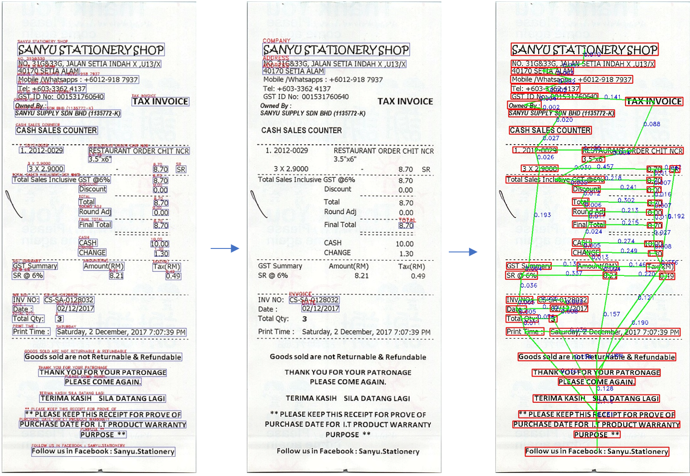
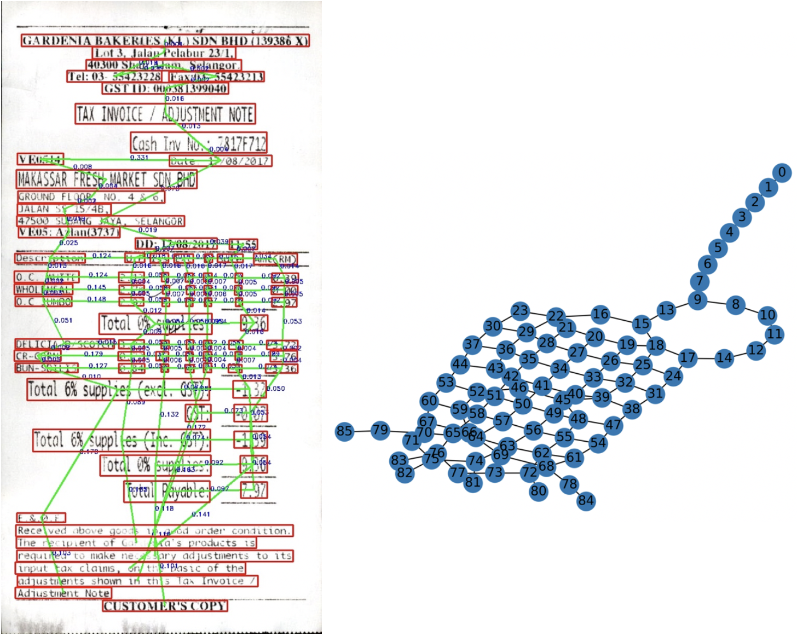
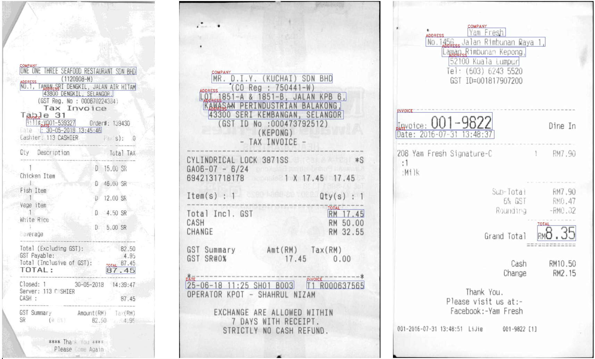

Information Extraction of Semi-Structured Documents.
==============================
A scalable and robust method of extracting relevant information from semi-structured documents(invoices, reciepts, ID cards, licenses and so on) using Graph Convolutional Networks(GCNs).

<p align="center">
 
</p>

<p align="center">
<i>Figure 1: Extraction of information from a document</i>
</p>

Table of Contents:
--------

- [Introduction](#Introduction)
- [Why Graphs?](#Why%20Graphs?)
- [Graph Convolutional Networks (GCNs)](#Graph%20Convolutional%20Networks%20(GCNs))
- [Steps of the Project](#Steps%20of%20the%20Project)
  + [Data Collection](#1.%20Data%20Collection)
  + [Labeling](#2.%20Labeling)
  + [Graph Modeling](#3.%20Graph%20Modeling)
  + [Features Engineering](#4.%20Features%20Engineering)
  + [GCN Modeling](#5.%20GCN%20modeling)
- [Conclusion](#Conclusion)
- [Code Navigation](#Project%20Organization)
- [References](#References:)


# Introduction:
Automated Information extraction is the process of extracting structured information from unstructured/semi structured documents. This project focuses on semi-structured documents which are documents such as invoices or purchase orders that do not follow a strict format the way structured forms do, and are not bound to specified data fields. 
Automated Information Extraction holds a lot of potential in the industry. As labeling data can be a very tedious job, using a machine learning techniuqes can improve efficacy and preserve work hours or the need to employ third party sources for labeling. 

This project supplements the process of the following tasks:
- Automatically scan images of invoices (bills) to extract valuable information.
- Build an automated system to automatically store revelant information from an invoice: eg: company name, address, date, invoice number, total  

The basic steps involved in Information Extraction are:
- Gather raw data (invoice images)
- Optical character recognition (OCR) engine such as [Tesseract](https://tesseract-ocr.github.io) or [Google Vision](https://cloud.google.com/vision/docs/ocr). This process is very simple and straightforward as shown in [tess_ocr.py](src/pipeline/tess_ocr.py)
- Extract relevant/salient information in a digestable format such as json for storage/analytics.

<p align="center">
 
</p>

<p align="center">
<i> Figure 2: An example of using an OCR engine: Tesseract for text extraction.</i>
</p>

The main issue/concern with this approach is that invoices do not follow a universal pattern. Utilities such as regex could be used to extract information based on pattern but it is not a scalable solution. As the data size increases, there is the need to deal with different patterns of documents which would break a brute-force searching algorithm.

<p align="center">
 
</p>

<p align="center">
<i> Figure 3: Different patterns of semi structured documents make it difficult to generalize an algorithm for Information Extraction(IE) </i>
</p>

### Solution:
-----------
What if we could have some labeled data, and use a transductive learning method where a model could predict the labels for the rest of the data? This approach would be highly scalable and convenient for a lot of problems pertaining to the domain.

Semi-Supervised Graph Convolutional Networks (GCNs) provide a platform for recognizing different patterns associated with different invoices/semi-structured documents. This method can be used in __Transductive learning/semi-supervised learning__ :. This can be used in auto-labeling/classification of desired classes(in our case: company, address, invoice, date and total) by learning graph patterns. 
[An Invoice Reading System Using a Graph Convolutional Network](https://link.springer.com/chapter/10.1007/978-3-030-21074-8_12) provides for the conceptual background for this project. I have relied on graph formation concepts from the paper but the code itself is my own.

# Why Graphs?
Graphs provide a robust data structure to approach the problem which can be used for transductive learning.
Simple introduction to Graphs and Graph Convolutional Networks (GCNs):<br>
A Graph _G = {V,E}_ where _V_ is the vertex set and _E_ is the edge set consists of three main components:
- _A_: Adjacency matrix of a graph: Represents the connection between the nodes.
- _D_: Degree matrix of a graph: Is the degree of 'connections' for each node. (sum of each row in _A_)
- _L_: Graph Laplacian  (_L = D - A_)

This can be easily understood by the following visual example:
<p align="center">
 
</p>

<p align="center">
<i> Figure 4: Visual Illustration of how a graph can be represented in matrices.</i>
</p>

# Graph Convolutional Networks (GCNs)

Graph Neural Networks is a subset of deep learning with a good amount of research done in it. [Graph Neural Networks: A Review of Methods and Applications](https://arxiv.org/pdf/1812.08434.pdf). This [medium article](https://towardsdatascience.com/graph-convolutional-networks-for-geometric-deep-learning-1faf17dee008) provides excellent introduction to Graph Neural Networks.


_Why are GCNs called convolutions?_

The aggregation over the neighborhood of a node in the network is analogous to a pooling operation in a convolutional neural network and the multiplication with the weight matrix W is analogous to a filtering operation. These operations are conceptually similar — hence the similarity in names between GCNs and CNNs.

Why Conventional Convolutional Neural Network methods dont work for graphs:
- There is no Euclidean distance in graphs.
- There is no notion of direction in graphs.

To solve the lack of solution to the problem that traditional CNNs provide, Graph Spectral Convolutions come in handy. For the sake of conciseness, here are the basic steps that involve Graph Spectral Convolution in a highly simplified manner:
- Transform the graph into the spectral domain using eigendecomposition
- Apply eigendecomposition to the specified kernel
- Multiply the spectral graph and spectral kernel (like vanilla convolutions)
- Return results in the original spatial domain (analogous to inverse Graph Fourier Transform)

From basic concepts from how graphs can be represented as matrices, Steps behind this:
- Calculate the Ajacent/weight matrix and Diagonal matrix for a graph
- Calculate the Laplacian matrix ( D- A) (give a sense of euclidean space)
- Calculate the eigenvectors of the Laplacian matrix (Spectral domain)
- You end up with a Fourier basis for the graph. 
- _Project both weights and data into that basis (results in a convolution)_


_In more technical terms: It’s possible to transform both our data and filters such that each filter is represented by a simple diagonalized matrix (all zeroes, except for values along the diagonal), that gets multiplied against a transformed version of the data. This simplification happens when you perform a Fourier Transform of your data. Fourier transforms are typically thought of in the context of functions, and (on a very high level), they represent any function as a weighted composition of simpler “frequency” functions; starting with low frequencies that explain the broad strokes pattern of the data, and ending with high frequencies that fill in the smaller details._

 Fourier Transform [video](https://www.youtube.com/watch?v=spUNpyF58BY) is a pretty complex mathematical process. Better explanation of that can be found [here](https://www.cs.yale.edu/homes/spielman/561/2009/lect02-09.pdf)
To build an intution of how it all ties to Fourier Transform, [this](https://www.math.ucla.edu/~tao/preprints/fourier.pdf) is an excellent resource. 


## Main Paper: 
SEMI-SUPERVISED CLASSIFICATION WITH GRAPH CONVOLUTIONAL NETWORKS 
https://arxiv.org/pdf/1609.02907.pdf

In Kipf and Welling’s Graph Convolutional Network, a convolution is defined by: 

x)

Where gθ is a kernel (θ represents the parameters) which is applied (represented by the star) to x, a graph signal. K stands for the number of nodes away from the target node to consider (the Kth order neighborhood, with k being the the closest order neighbor). T denotes the Chebyshev polynomials as applied to L̃ which represents the equation:


Where λ max denotes the largest eigenvalue of L, the normalized graph laplacian. Multiple convolutions can be performed on a graph, and the output is aggregated into Z.


Chebyshev polynomial
------------------------

First order of Chebyshev Polynomial simply means that the metric used to determine the similarity between 2 nodes is based on the node’s immediate neighborhood. Second order (and beyond) means the metric used to determine similarity considers a node’s immediate neighborhood, but also the similarities between the neighborhood structures (with each increasing order, the depth of which nodes are considered increases).The kernel equals the sum of all Chebyshev polynomial kernels applied to the diagonal matrix of scaled Laplacian eigenvalues for each order of k up to K-1.

__ChebNets and GCNs are very similar, but their largest difference is in their choices for value K in eqn. 1. In a GCN, the layer wise convolution is limited to K = 1__


# Steps of the Project:
- Collect raw data of invoices (raw images)
- Annonate/label all the images with relevant labels
- Model a graph from the above information
- Convert the graph to type torch geometric dataset for modeling
- Run the graph dataset through a GCN Semi-Supoervised Learning Process for predictions.


### 1. Data Collection
For the project, I am using the dataset provided in the  [ICDAR-SROIE](https://rrc.cvc.uab.es/?ch=13&com=introduction)<br>
The dataset contains these files:
- Images: 626 whole scanned receipt images.
- Labels file: one text file for each image, containing the items items extracted via OCR.: Each receipt image has been processed by an OCR engine, which extracted texts contained in each receipt. Each word is stored as a separate row, preceded by the coordinates of its location on the image.
(labels file can be generated with an OCR engine. An example is shown in [tess_ocr.py](src/pipeline/tess_ocr.py)<br>
_The labels file does not contain word level bounding boxes. It consists of inconsistent bounding criteria. Knowing that, I have still used the file as it was more convenient for me. A word level OCR as mentioned above would yield in a better performance._

### 2. Labeling
- Additionally, I manually labeled each image with ground truths containing the following labels: company, adddress, invoice, date, total

### 3. Graph Modeling
<p align="left">

</p>

_Figure 5: The graph modeling which results in transforming the document to a digestable graph format for the Graph Convolutional Network algorithm_ 

Graph Modeling is the most essential part of the project. There needs to be a robust and consistent method of modeling the invoices into graphs regardless of their structure/pattern. Ensuring a universal rule towards modeling the graph is an integral part of being able to form consistent graphs which will be used in graph learning. 

For this project, The following structure is followed. Each word/object consists of only one neighbor in each direction with a maximum of four total edges/connections. This is strictly enforced to maintain robustness. _The rules below ensure proper and consistent formation for any semi-structure document system for data beyond this project._

<p align="left">

</p>


_Figure 6: Graph modeling system explained in this paper: [An Invoice Reading System Using a Graph Convolutional Network](https://link.springer.com/chapter/10.1007/978-3-030-21074-8_12)_ 

The graph modeling process includes the following steps:
- Line formation:
    - Sort words based on Top coordinate:
    - Form lines as group of words which obeys the following:
    - Two words (W_a and W_b) are in same line if:
        Top(W_a) <= Bottom(W_b) and Bottom(W_a) >= Top(W_b)
    - Sort words in each line based on Left coordinate

- Graph formation:
    - Read words from each line starting from topmost line going towards bottommost line
    - For each word, perform the following:
        - Check words which are in vertical projection with it (similar to line formation but vertically).
        - Calculate RD_l and RD_r for each of them 
        - Select nearest neighbour words in horizontal direction which have least magnitude of RD_l and RD_r,provided that those words do not have an edge in that direction.
        - In case, two words have same RD_l or RD_r, the word having higher top coordinate is chosen.
        - Repeat steps from 2.1 to 2.3 similarly for retrieving nearest neighbour words in vertical direction by taking horizontal projection, calculating RD_t and RD_b and choosing words having higher left co-ordinate incase of ambiguity
        - Draw edges between word and its 4 nearest neighbours if they are available.

The nodes represet each word/object and edges represent the connection with other words based on the above parameters.

_This ensures that words are aligned from top left corner of the image first, 
going line by line from left to right and at last the final bottom right word of the page is read._


<p align="left">

</p>

_Figure 7: Breakdown of the intermediate steps bounding boxes, labeling and graph modeling_

These set of rules are scalable and work for more complex structures:

<p align="left">

</p>

_Figure 8: Demonstration of how the set of parameters can be generalized for more complex document structures_

### 4. Features Engineering
Node features consisted of the following:
- Line number of the word/Object
- Relative distances of the word/objects if they exist (RD_l,RD_r,RD_b and RD_t) if a distance is a certain direction is missing, it is placed as 0.
- Character level features: n_lower, n_upper, n_spaces, n_alpha, n_numeric,n_special
- Additional features such as word embeddings can be added. It was ommited for this project as the dataset consisted of bounding boxes for a group of words rather than individual words which would cause imbalance in the number of embeddings. For a document whose bounding boxes are extracted in an individual word level, word embeddings([Byte Pair Encodings](https://en.wikipedia.org/wiki/Byte_pair_encoding) would provide a better features representation.
- Labels were created for the manually annontated classes. Any object/word not pertaining to the desired were labeled as 'undefined' which included majority of the dataset.

### 5. GCN modeling

The train, validation and test sets included:
500 receipts for training, 63 receipts for validation, and 63 for testing.

- Due to the imbalanced dataset, class weights were added to ensure proper learning of weights during backpropagation of the loss. 
- The negative log likelihood loss [NLLLoss function](https://pytorch.org/docs/master/generated/torch.nn.NLLLoss.html) was used with the following weights:

Following were the weights used to handle the imbalance in the dataset. (as undefined is more)

```
Class number distribution in the dataset:
company: 687
address: 1677
invoice: 598
date: 624
total: 626
undefined: 29414

Weights used to balance class disribution for NLLloss propagation:
{'company': 8.1577, 'address':3.3419, 'invoice':9.3718, 'date':8.9813, 'total':8.9526, 'undefined':0.1905}
 
```


 3 hidden GCN layers were stacked, the first layer learns 16 different filters (16 different graph connection patterns), and the second layer learn 32 filters, learning to recognize 32 combinations of the 16 patterns learned in layer 1. This hierarchical compositionality property, also found in CNN’s, gives the model the power to generalize to unseen layouts.


Two differnt Graph Convolutional Models were used. Graph Convolutional Network and  [Chebyshev Convolutional Network](https://arxiv.org/abs/1606.09375)
The kernel equals the sum of all Chebyshev polynomial kernels applied to the diagonal matrix of scaled Laplacian eigenvalues for each order of k up to K-1.

First order simply means that the metric used to determine the similarity between 2 nodes is based on the node’s immediate neighborhood. Second order (and beyond) means the metric used to determine similarity considers a node’s immediate neighborhood, but also the similarities between the neighborhood structures (with each increasing order, the depth of which nodes are considered increases).

Third order of polynomials were used.

__ChebNets and GCNs are very similar, but their largest difference is in their choices for value K in eqn. 1. In a GCN, the layer wise convolution is limited to K = 1__


All the graphs were combined to form an unconnected adjacency matrix that consisted of 33626 nodes.<br>
training nodes: 26947, valdiation nodes: 3221, testing nodes: 3458

<p align="left">

</p>

<p align="center">
<i><b>Figure 9: Abbreviated Steps of GCN:</b> https://github.com/tkipf/gcn</i>
</p>


The model was trained with the following parameters:
```
learning rate : 0.01
L2 regularization : 5e-10
hidden layers : 4 
early stopping : 50 epochs. (if the validation loss did not decrease for 50 epochs)

The best test results were: 
epoch: 981, train_loss:0.1455, val_loss:0.7506, Train: 0.9324, Val: 0.8600, Test: 0.8713

```
| Classes | Accuracy |
| --------| ------------- |
| Company | 98.5  | 
| Address | 86.5 | 
| Invoice | 54.8  | 
| Date | 53.9 |
| Total | 34.9 |
| Undefined | 86.1 |


__There is a spillage of 'total' into undefined due to obscurity later discussed in the conclusion__ 

### Confusion Matrix for test data in epoch 521:

Epoch: 521, train_loss:0.1637, val_loss:0.7775, Train: 0.8614, Val: 0.7970, Test: 0.8039

| Classes | Company  | Address | Invoice | Date | Total | Undefined |
| --------| ------------- | ------------- | ------------- | ------------- | ------------- | ------------- |
| Company | 66  | 1  | 0  | 0  | 0 | 0  |
| Address | 6 | 146  | 1 | 1 | 0  | 10  |
| Invoice | 0  | 2  | 37  | 6  | 1 | 16 |
| Date | 0  | 1 | 5  | 40 | 1  | 16  |
| Total | 0  | 0  | 1 | 0  | 21  | 41  |
| Undefined | 16  | 42  | 99 | 142 | 270  | 2470  |

<p align="center">
<i>Table: Confusion matrix for the classes.</i>
</p>

## Conclusion

The biggest issue with my approach as I have mentioned above, is that there is inconsistencies in the bounding boxes for the texts provided in the raw dataset. Due to this, manual annontation was difficult as some objects would have double meanings.
For example: 'total amount' was difficult to have a consistent pattern as some bounding boxes consisted of currency letters too. Also, some totals were inclusive of the taxes whereas others did not have the option around it. Basically, there were many 'totals' in the invoices with inconsistencies. Also some labels consisted of multiple words in them adding to the ambiguity.
This caused erroneous learning as graph patterns are very dependent on having a consistent frame of reference.

For example:<br>
Total : 20<br>
20<br>
Total Inc Taxes : 20 <br>

Similar issues were for Invoice and date. 

Using a word level approach would lead to a better performance as it would negate the inconsistencies of the bounding boxes  provided in the dataset
for a better one, consider each single word from Tesseract and label them which would yield a better model.



<p align="center">
<i>Figure 10: Inconsistencies in the provided bounding boxes.</i>
</p>

## Project Organization
------------

    ├── data
    │   ├── external       <- Data from third party sources. [ICDAR-SRIOE]
    │   ├── interim        <- Intermediate data that has manually annontated labels.
    │   ├── processed      <- Final data in format torch geometric format for modelling.
    │   └── raw            <- raw data for this project (cleaned filenames)
    │
    ├── notebooks          
    │   └── make_dataset.py <- graph formation in jupyter notebook format
    ├── src                 <- Source code for use in this project.
    │   │ 
    │   ├── data           <- Script to format data from 'external' to 'raw'
    │   │   └── make_dataset.py
    │   │   
    │   ├── models         <- Scripts to train,validate and test the GCN model 
    │   │   └── final_model.py
    │   │   
    │   └── pipeline
    │       ├── graph.py            <- Construct a graph from raw data. (export figures of graphs)
    │       ├── data_for_GCN.py    <- Convert graph to a Torch Geometric dataset for GCN modeling.
    │       ├── tess_ocr.py         <- Convert any document to image formate
    │       └── visualize.py        <- Visualize/export bounding boxes and labels
    │
    ├── LICENSE     
    │
    ├── README.md      
    │
    └── requirements.txt    <- modules required to run the files

      

--------

### References:
- [An Invoice Reading System Using a Graph Convolutional Network](https://link.springer.com/chapter/10.1007/978-3-030-21074-8_12) 
- [Graph Neural Networks: A Review of Methods and Applications](https://arxiv.org/pdf/1812.08434.pdf )
- [Semi-Supervised Classification with Graph Convolutional Networks](https://arxiv.org/pdf/1609.02907.pdf)
- [A Tale of Two Convolutions: Differing Design Paradigms for Graph Neural Networks](https://towardsdatascience.com/a-tale-of-two-convolutions-differing-design-paradigms-for-graph-neural-networks-8dadffa5b4b0)
- [Graph Neural Networks: A Review of Methods and Applications](https://arxiv.org/pdf/1812.08434.pdf)
- [Fourier Transform](https://www.math.ucla.edu/~tao/preprints/fourier.pdf)
- [Convolutional Neural Networks on Graphs with Fast Localized Spectral Filtering](https://arxiv.org/pdf/1606.09375.pdf)


