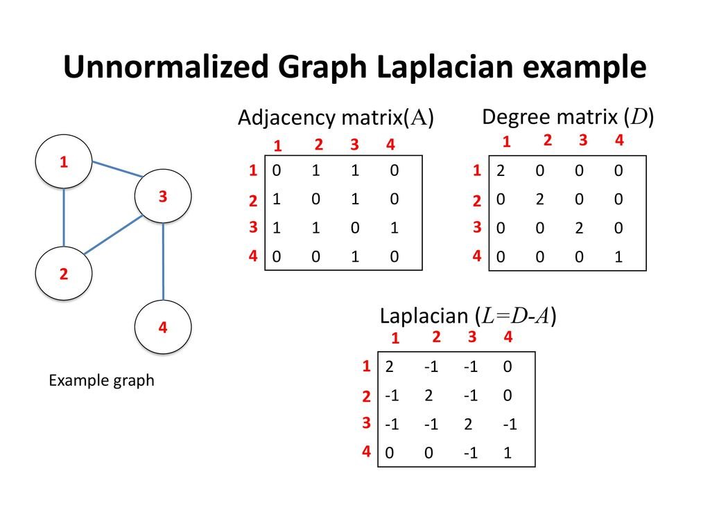
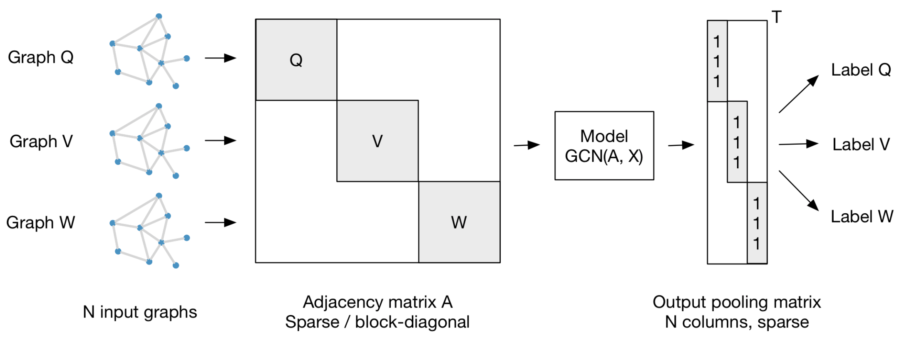

info_extraction_receipts
==============================

# Introduction:

Automated Information extraction is the process of extracting structured information from unstructured/semi structured documents. This project focuses on semi-structured documents. Semi-structured documents are documents such as invoices or purchase orders that do not follow a strict format the way structured forms to, and are not bound to specified data fields. 
Information Extraction holds a lot of potential in automation. To name a few applications:
- Automatically scan images of invoices (bills) to extract valuable information.
- Build an automated system to automatically store revelant information from an invoice: eg: company name, address, date, invoice number, total  

In order to be able to do this, here are the basic steps:
- Gather raw data (invoice images)
- Optical character recognition (OCR) engine such as [Tesseract](https://tesseract-ocr.github.io) or [Google Vision](https://cloud.google.com/vision/docs/ocr).
- Extract relevant/salient information in a digestable format such as json for storage/analytics.

The main issue/concern with this approach is that invoices do not follow a universal pattern. 

 

__Figure 1__: _Different patterns of semi structured documents make it difficult to generalize a pattern for Information Extraction(IE)_

&ensp;&ensp;&ensp;&ensp;&ensp;&ensp;&ensp;&ensp;&ensp;&ensp; __Figure 1__: _Different patterns of semi structured documents make it difficult to generalize a pattern for Information Extraction(IE)_

Due to the varied nature of invoices, it is difficult to have a general OCR script that recognizes each element of the dataset. 

Solution:
Graph Convolutional Networks (GCNs) provide a platform for recognizing different patterns associated with different invoices/semi-structured documents. This method can be used in __Transductive learning/semi-supervised learning__. This can be used in auto-labeling/classification of desired classes(in our case: company, address, invoice, date and total) by learning graph patterns. 
[An Invoice Reading System Using a Graph Convolutional Network](https://link.springer.com/chapter/10.1007/978-3-030-21074-8_12) provides for the conceptual background for this project. Top level concepts are derived from the paper and I would like to thank the authors for their contribution. 

# Why Graphs?
"The aggregation over the neighborhood of a node in the network is analogue to a pooling operation in a convolutional neural network and the multiplication with the weight matrix W is analogue to a filtering operation. Although these operations are similar — hence the similarity in names between GCNs and CNNs — they are not the same.
"

Simple introduction to Graphs and Graph Convolutional Networks (GCNs): 
A Graph _G = {V,E}_ where _V_ is the vertex set and _E_ is the edge set consists of three main components:
- _A_: Adjacency matrix of a graph: Represents the connection between the nodes.
- _D_: Degree matrix of a graph: Is the degree of 'connections' for each node. (sum of each row in _A_)
- _L_: Graph Laplacian  (_L = D - A_)

This can be easily understood by the following visual example:

 

# Graph Convolutional Networks (GCNs)

Graph Neural Networks is a subset of deep learning with a good amount of research done in it. [Graph Neural Networks: A Review of Methods and Applications](https://arxiv.org/pdf/1812.08434.pdf). This [medium article](https://towardsdatascience.com/graph-convolutional-networks-for-geometric-deep-learning-1faf17dee008) provides excellent introduction to Graph Neural Networks.

Why Conventional Convolutional Neural Network methods dont work:
- There is no Euclidean distance in graphs.
- Graphs have a certain number of nodes. 
- There is no notion of direction in graphs.

For the sake of conciseness, here are the basic steps that involve Graph Spectral Convolution in a highly simplified manner:
- Transform the graph into the spectral domain using eigendecomposition
- Apply eigendecomposition to the specified kernel
- Multiply the spectral graph and spectral kernel (like vanilla convolutions)
- Return results in the original spatial domain (analogous to inverse GFT)

Steps behind this:
- Calculate the Ajacent/weight matrix and Diagonal matrix for a graph
- Calculate the Laplacian matrix ( D- A) (give a sense of euclidean space)
- Calculate the eigenvectors of the Laplacian matrix (Spectral domain)
- You end up with a Fourier basis for the graph. 
- _Project both weights and data into that basis (results in a convolution)_

It’s possible to transform both your data and your filters such that each filter is represented by a simple diagonalized matrix (all zeroes, except for values along the diagonal), that gets multiplied against a transformed version of the data. This simplification happens when you perform a Fourier Transform of your data. Fourier transforms are typically thought of in the context of functions, and (on a very high level), they represent any function as a weighted composition of simpler “frequency” functions; starting with low frequencies that explain the broad strokes pattern of the data, and ending with high frequencies that fill in the smaller details.

Principle behind this:
- Calculate the Ajacent/weight matrix and Diagonal matrix for a graph
- Calculate the Laplacian matrix ( D- A) (give a sense of euclidean space)
- Calculate the eigenvectors of the Laplacian matrix (Spectral domain)
- You end up with a Fourier basis for the graph. 
- Project both weights and data into that basis (results in a convolution)

 Fourier Transform [video](https://www.youtube.com/watch?v=spUNpyF58BY). Better explanation of that can be found [here](https://www.cs.yale.edu/homes/spielman/561/2009/lect02-09.pdf
To build an intution of how it all ties to Fourier Transform, [this](https://www.math.ucla.edu/~tao/preprints/fourier.pdf) is an excellent paper. 
__Key take-away__: When you calculate the eigenvectors of the Laplacian, you end up with a Fourier basis for the graph

# Main Paper: 
SEMI-SUPERVISED CLASSIFICATION WITH GRAPH CONVOLUTIONAL NETWORKS 
https://arxiv.org/pdf/1609.02907.pdf

In Kipf and Welling’s Graph Convolutional Network, a convolution is defined by: 

x)

Where gθ is a kernel (θ represents the parameters) which is applied (represented by the star) to x, a graph signal. K stands for the number of nodes away from the target node to consider (the Kth order neighborhood, with k being the the closest order neighbor). T denotes the Chebyshev polynomials as applied to L̃ which represents the equation:

Where λ max denotes the largest eigenvalue of L, the normalized graph laplacian. Multiple convolutions can be performed on a graph, and the output is aggregated into Z.

Chebyshev polynomial
------------------------

The kernel equals the sum of all Chebyshev polynomial kernels applied to the diagonal matrix of scaled Laplacian eigenvalues for each order of k up to K-1.

First order simply means that the metric used to determine the similarity between 2 nodes is based on the node’s immediate neighborhood. Second order (and beyond) means the metric used to determine similarity considers a node’s immediate neighborhood, but also the similarities between the neighborhood structures (with each increasing order, the depth of which nodes are considered increases).

__Consider avoiding Chebyshev to avoid overfitting.__

__ChebNets and GCNs are very similar, but their largest difference is in their choices for value K in eqn. 1. In a GCN, the layer wise convolution is limited to K = 1__

# Steps of the Project:
- Collect data of invoices (raw images)
- Obtain bounding boxes for text in the images
- Model a graph from the above information
- Run the graph through a GCN Semi-Supoervised Learning Process to get desired outputs/classes.

Sources:

[PICK: Processing Key Information Extraction from Documents using Improved Graph Learning-Convolutional Networks](https://arxiv.org/pdf/2004.07464.pdf)

Project Organization
------------

    ├── LICENSE
    ├── README.md          <- The top-level README for developers using this project.
    ├── data
    │   ├── external       <- Data from third party sources.
    │   ├── interim        <- Intermediate data that has been transformed.
    │   ├── processed      <- The final, canonical data sets for modeling.
    │   └── raw            <- The original, immutable data dump.
    │
    ├── models             <- Trained and serialized models, model predictions, or model summaries
    │
    ├── notebooks          <- Jupyter notebooks. Naming convention is a number (for ordering),
    │                         the creator's initials, and a short `-` delimited description, e.g.
    │                         `1.0-jqp-initial-data-exploration`.
    │
    ├── references         <- Data dictionaries, manuals, and all other explanatory materials.
    │
    ├── reports            <- Generated analysis as HTML, PDF, LaTeX, etc.
    │   └── figures        <- Generated graphics and figures to be used in reporting
    │
    ├── requirements.txt   <- The requirements file for reproducing the analysis environment

    ├── src                <- Source code for use in this project.
    │   ├── __init__.py    <- Makes src a Python module
    │   │
    │   ├── data           <- Scripts to download or generate data
    │   │   └── make_dataset.py
    │   │
    │   ├── features       <- Scripts to turn raw data into features for modeling
    │   │   └── build_features.py
    │   │
    │   ├── models         <- Scripts to train models and then use trained models to make
    │   │   │                 predictions
    │   │   ├── predict_model.py
    │   │   └── train_model.py
    │   │
    │   └── visualization  <- Scripts to create exploratory and results oriented visualizations
    │       └── visualize.py

--------

References: 
[Graph Neural Networks:
A Review of Methods and Applications](https://arxiv.org/pdf/1812.08434.pdf )

https://arxiv.org/pdf/1609.02907.pdf 
https://towardsdatascience.com/a-tale-of-two-convolutions-differing-design-paradigms-for-graph-neural-networks-8dadffa5b4b0 
https://arxiv.org/pdf/1812.08434.pdf 
https://www.math.ucla.edu/~tao/preprints/fourier.pdf 
 
https://arxiv.org/pdf/1606.09375.pdf
